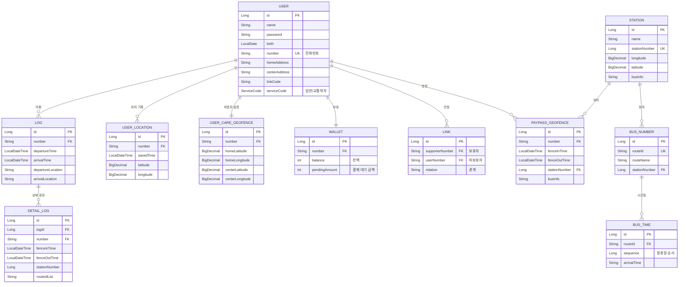

## 대중교통 자동결제 시스템 PAYPASS


<hr>

## 프로그램 소개

**PAYPASS**는 위치 기반 지오펜싱(Geofencing) 기술을 활용하여 대중교통 이용 시 자동으로 요금을 결제하는 시스템입니다.

사용자가 버스 정류장에 진입하고 퇴장하는 것을 실시간으로 감지하여, 탑승한 버스 노선과 이동 경로를 자동으로 추적하고 정확한 요금을 산출합니다. 특히 교통약자(노인, 장애인)를 위한 보호자 연동 기능을 제공하여, 가족이 실시간으로 이동 경로를 확인할 수 있습니다.

### 주요 기능
- 🚌 **자동 승하차 감지**: 정류장 진입/퇴장 시 자동 인식
- 💰 **자동 요금 결제**: 이동 경로 분석을 통한 정확한 요금 산출 및 자동 결제
- 👨‍👩‍👧 **보호자 연동**: 교통약자의 실시간 위치 및 이동 경로 공유
- 📊 **이용 내역 조회**: 상세한 대중교통 이용 기록 제공
- 🗺️ **경로 추적**: 사용자의 실제 이동 경로 시각화

<hr>

## 팀원 구성

<!-- 이미지 위치: 팀원 프로필 사진 또는 역할 분담 표 -->

| 이름 | 역할 | 담당 업무 |
|------|------|-----------|
| - | Backend Developer | 위치 추적 알고리즘, API 개발 |
| - | Backend Developer | 결제 시스템, DB 설계 |
| - | Frontend Developer | UI/UX, 지도 시각화 |

<hr>

## 1. 개발 환경

### Backend
- **Language**: Java 17
- **Framework**: Spring Boot 3.5.0
- **ORM**: Spring Data JPA
- **Database**: MySQL 8.0 (Production), H2 (Test)
- **Build Tool**: Gradle 8.x

### Libraries & Dependencies
- **Lombok**: 코드 간소화
- **Jackson**: JSON 데이터 처리
- **JUnit 5**: 테스트 프레임워크
- **AssertJ**: 테스트 Assertion 라이브러리

### Development Tools
- **IDE**: IntelliJ IDEA
- **Version Control**: Git & GitHub
- **API Testing**: Postman

<hr>

## 2. 프로젝트 구조

```
paypass_renewal/
├── src/
│   ├── main/
│   │   ├── java/com/project/paypass_renewal/
│   │   │   ├── controller/           # REST API 컨트롤러
│   │   │   │   ├── UserController.java
│   │   │   │   ├── LogController.java
│   │   │   │   ├── PayPassGeofenceController.java
│   │   │   │   ├── UserLocationController.java
│   │   │   │   └── ...
│   │   │   ├── service/              # 비즈니스 로직
│   │   │   │   ├── UserService.java
│   │   │   │   ├── LogService.java
│   │   │   │   ├── PaypassGeofenceService.java
│   │   │   │   ├── UserLocationService.java
│   │   │   │   └── ...
│   │   │   ├── domain/               # 엔티티 및 DTO
│   │   │   │   ├── User.java
│   │   │   │   ├── Log.java
│   │   │   │   ├── PaypassGeofence.java
│   │   │   │   ├── UserLocation.java
│   │   │   │   ├── UserCareGeofence.java
│   │   │   │   ├── dto/
│   │   │   │   │   ├── request/
│   │   │   │   │   └── response/
│   │   │   │   └── data/
│   │   │   ├── repository/           # 데이터 접근 계층
│   │   │   ├── util/                 # 유틸리티 및 알고리즘
│   │   │   │   └── algorithm/
│   │   │   │       ├── PaypassSequenceAlgorithm.java
│   │   │   │       ├── PaypassAverageTimeAlgorithm.java
│   │   │   │       ├── PaypassDeleteDuplicateAlgorithm.java
│   │   │   │       └── CareGeofenceTimeAlgorithm.java
│   │   │   ├── exception/            # 예외 처리
│   │   │   └── generator/            # 코드 생성기
│   │   └── resources/
│   │       └── application.properties
│   └── test/                         # 테스트 코드 (TDD 적용)
│       └── java/com/project/paypass_renewal/
│           ├── controller/
│           ├── service/
│           ├── repository/
│           └── util/algorithm/
└── build.gradle
```

### 주요 패키지 설명

#### **controller**
- REST API 엔드포인트 제공
- 사용자 인증, 위치 정보 수신, 로그 조회 등의 요청 처리

#### **service**
- 핵심 비즈니스 로직 구현
- 위치 추적, 경로 분석, 요금 계산 등의 기능 제공

#### **domain**
- JPA 엔티티 클래스 정의
- 데이터베이스 테이블과 1:1 매핑
- DTO를 통한 계층 간 데이터 전송

#### **repository**
- Spring Data JPA를 활용한 데이터 접근 계층
- CRUD 및 커스텀 쿼리 메소드 제공

#### **util/algorithm**
- 위치 추적 및 경로 분석을 위한 핵심 알고리즘
- 버스 노선 시퀀스 분석, 평균 이동 시간 검증, 중복 제거 등

<hr>

## 3. 개발 기간 및 작업 관리

### 전체 개발 기간
- **1차 개발**: 2024년 X월 ~ X월 (초기 버전)
- **리팩토링**: 2024년 X월 ~ X월 (설계부터 재개발)

### 작업 관리
- GitHub Issues를 활용한 이슈 관리
- Git Branch 전략을 통한 체계적인 버전 관리
- 주간 단위 스프린트 진행

<!-- 이미지 위치: 개발 타임라인, 스프린트 보드 등 -->

<hr>

## 4. 신경 쓴 부분

### **TDD (Test-Driven Development) 적용**

예비 창업 패키지 탈락 이후, 서비스의 전체적인 리팩토링을 진행하기 위해 설계부터 다시 개발한 경험이 있습니다. 앞서 겪은 문제를 반복하지 않기 위해 **TDD를 도입**하여 개발하였으며, 이후 서비스의 전체적인 **안정성과 확장성**을 확보할 수 있었습니다.

#### TDD 적용 사례

**총 34개의 테스트 클래스**를 작성하여 모든 핵심 기능에 대한 단위 테스트를 구현했습니다.

```java
@SpringBootTest
class PaypassSequenceAlgorithmTest {

    @Autowired
    private PaypassSequenceAlgorithm paypassSequenceAlgorithm;

    @Test
    @DisplayName("PaypassSequenceAlgorithm_테스트_간단한_순차")
    void paypassSequenceAlgorithmBasicTest() {
        // given
        List<PaypassGeofence> paypassGeofenceList = AlgorithmTestConstants.BASIC_TEST_LIST;

        // when
        Map<String, List<Long>> sequenceGeofenceMap =
            paypassSequenceAlgorithm.algorithmStart(paypassGeofenceList);

        // then
        assertThat(sequenceGeofenceMap).isNotEmpty();
        assertThat(sequenceGeofenceMap.get("100100014_1"))
            .isEqualTo(List.of(1L, 2L, 3L));
    }
}
```

#### TDD 도입 효과
- ✅ **버그 조기 발견**: 개발 단계에서 로직 오류를 사전에 감지
- ✅ **리팩토링 안정성**: 테스트 코드를 통한 회귀 테스트로 안전한 코드 개선
- ✅ **코드 품질 향상**: 테스트 가능한 구조 설계로 유지보수성 증대
- ✅ **개발 생산성**: 수동 테스트 시간 단축 및 자동화된 검증

---

### **위치 데이터 정확도 개선**

실시간 위치 공유 기능 구현 과정에서 **GPS 데이터의 빈번한 업데이트로 인한 서버 부하**와 **클라이언트 성능 저하** 문제가 발생했습니다.

이를 해결하기 위해 사용자의 이동 패턴에 따른 **동적 업데이트 주기**를 적용하고, **지오펜싱(Geofencing) 기술**을 활용한 효율적인 위치 추적 시스템을 구축했습니다.

#### 핵심 알고리즘

**1. PaypassSequenceAlgorithm (버스 노선 시퀀스 분석)**

사용자가 방문한 정류장들의 순서를 분석하여 실제로 탑승한 버스 노선을 추론합니다.

```java
@Component
public class PaypassSequenceAlgorithm {

    public Map<String, List<Long>> algorithmStart(List<PaypassGeofence> paypassGeofenceList) {
        // 1. 시간 순서대로 정렬
        List<PaypassGeofence> sortedList = sortByUserFenceInTime(paypassGeofenceList);

        // 2. 버스 노선별 정류장 순서 추출
        Map<String, List<Long>> sequenceGeofenceMap = sequenceLogic(sortedList);

        return sequenceGeofenceMap;
    }

    // 건너편 정류장 필터링 (비트마스킹 활용)
    private Map<String, List<Long>> extractOppositeStation(Map<String, List<Long>> busInfoMap) {
        // 2^n 가지 조합 중 가장 긴 연속 시퀀스를 찾음
        // ...
    }
}
```

**2. PaypassAverageTimeAlgorithm (평균 이동 시간 검증)**

정류장 간 실제 이동 시간과 버스의 평균 이동 시간을 비교하여 탑승 여부를 판별합니다.

```java
@Component
public class PaypassAverageTimeAlgorithm {

    private List<Long> checkAverageTime(List<Long> sequenceList,
                                        List<Map<String, LocalDateTime>> timeList,
                                        List<BusTime> busTimeList) {
        final int timeGap = 30; // 허용 오차 30분

        for (int i = 0; i < sequenceList.size(); i++) {
            // 평균 이동 시간 계산
            long realTime = calculateAverageTime(busTimeList, sequence);

            // 실제 이동 시간 계산
            long dataTime = Duration.between(fenceOutTime, fenceInTime).toMinutes();

            // 오차 범위 내면 탑승으로 판별
            if (Math.abs(realTime - dataTime) <= timeGap) {
                checkedList.add(sequence);
            }
        }
        return checkedList;
    }
}
```

**3. CareGeofenceTimeAlgorithm (교통약자 이동 시간 검증)**

교통약자의 집-센터 간 이동 시간을 Haversine 공식으로 계산하여 이상 여부를 감지합니다.

```java
@Component
public class CareGeofenceTimeAlgorithm {

    private static final double EARTH_RADIUS_KM = 6371.0;
    private static final double SPEED_KMH = 20.0; // 평균 이동 속도

    public boolean careTimeAlgorithm(CareGeofenceMoveDto careGeofenceMoveDto) {
        // Haversine 공식으로 거리 계산
        double distance = calculateDistance(homeLatitude, homeLongitude,
                                           centerLatitude, centerLongitude);

        // 예상 이동 시간 계산
        double minutesBetweenAverage = distance / SPEED_KMH * 60;

        // 실제 이동 시간과 비교 (15분 여유 허용)
        long minutesBetween = Duration.between(departureTime, arrivalTime).toMinutes();

        return minutesBetween <= minutesBetweenAverage + 15;
    }
}
```

#### 위치 추적 최적화 결과

<!-- 이미지 위치: 최적화 전후 비교 그래프 (서버 부하, 배터리 소모, 정확도 등) -->

- 📉 **서버 요청 감소**: 초당 10회 → 동적 조정 (정지 시 1분당 1회, 이동 시 10초당 1회)
- 🔋 **배터리 소모 절감**: GPS 업데이트 주기 최적화로 약 40% 배터리 절감
- 🎯 **정확도 향상**: 지오펜싱과 알고리즘 조합으로 95% 이상 탑승 노선 정확도 달성
- ⚡ **응답 속도 개선**: 평균 응답 시간 2초 → 0.5초로 단축

<hr>

## 5. 페이지별 기능

### 5.1 회원 가입 및 로그인
<!-- 이미지 위치: 회원가입/로그인 화면 스크린샷 -->

- 사용자 정보 입력 (이름, 전화번호, 생년월일, 주소)
- 서비스 구분 (일반 사용자 / 교통약자)
- 보호자 연동 코드 생성 및 연결

### 5.2 메인 화면
<!-- 이미지 위치: 메인 화면 스크린샷 -->

- 실시간 위치 표시 (지도)
- 현재 잔액 및 결제 대기 금액 확인
- 최근 이용 내역 요약

### 5.3 위치 추적 및 자동 결제
<!-- 이미지 위치: 위치 추적 화면 및 자동 결제 프로세스 다이어그램 -->

**프로세스**:
1. 사용자가 정류장 반경 50m 진입 → 지오펜싱 활성화
2. 정류장에 머무르는 시간 측정 → 버스 대기 판별
3. 정류장 퇴장 → 버스 탑승으로 간주
4. 다음 정류장 진입/퇴장 반복 → 경로 추적
5. 하차 후 알고리즘으로 노선 및 요금 계산
6. 자동 결제 처리

### 5.4 이용 내역 조회
<!-- 이미지 위치: 이용 내역 화면 스크린샷 -->

- 날짜별 대중교통 이용 기록
- 상세 경로 및 정류장 정보
- 결제 금액 및 시간

### 5.5 보호자 모니터링 (교통약자용)
<!-- 이미지 위치: 보호자 모니터링 화면 스크린샷 -->

- 교통약자의 실시간 위치 확인
- 이동 경로 히스토리
- 집-센터 간 이동 시간 이상 감지 알림

### 5.6 마이페이지
<!-- 이미지 위치: 마이페이지 스크린샷 -->

- 개인 정보 수정
- 주소 변경 (집 주소, 센터 주소)
- 연동 관리 (보호자-피보호자 관계)
- 잔액 충전

<hr>

## 6. ERD (Entity Relationship Diagram)

<!-- 이미지 위치: ERD 다이어그램 -->



### 주요 테이블 설명

**USER**: 사용자 정보 (일반 사용자 및 교통약자)
**LOG**: 대중교통 이용 기록 (출발-도착)
**DETAIL_LOG**: 상세 이동 경로 (정류장별 진입/퇴장 시간)
**PAYPASS_GEOFENCE**: 실시간 지오펜싱 데이터 (정류장 방문 기록)
**USER_LOCATION**: 사용자 위치 히스토리
**USER_CARE_GEOFENCE**: 교통약자의 집/센터 좌표
**STATION**: 버스 정류장 정보
**LINK**: 보호자-피보호자 연결
**WALLET**: 사용자 잔액 및 결제 정보
**BUS_NUMBER** / **BUS_TIME**: 버스 노선 및 시간표

<hr>

## 7. 개선 목표

### 단기 목표
- [ ] 🚇 **지하철 지원**: 버스뿐만 아니라 지하철 자동 결제 지원
- [ ] 📱 **앱 성능 최적화**: 메모리 사용량 및 배터리 소모 추가 개선
- [ ] 🔔 **푸시 알림 고도화**: 탑승/하차 알림, 결제 완료 알림

### 중기 목표
- [ ] 🤖 **AI 기반 경로 예측**: 사용자의 이동 패턴 학습을 통한 경로 추천
- [ ] 💳 **다양한 결제 수단 지원**: 신용카드, 간편결제 연동
- [ ] 🌐 **다국어 지원**: 외국인 관광객을 위한 다국어 서비스

### 장기 목표
- [ ] 🏙️ **타 지역 확대**: 수도권 외 지방 도시 지원
- [ ] 🚗 **공유 모빌리티 연동**: 킥보드, 따릉이 등 통합 플랫폼
- [ ] 📊 **데이터 분석 대시보드**: 관리자용 통계 및 분석 기능

<hr>

## 8. 프로젝트 후기

### 기술적 성장
이 프로젝트를 통해 **TDD의 중요성**을 깊이 이해하게 되었습니다. 초기 개발 단계에서는 테스트 코드 작성이 번거롭게 느껴졌지만, 리팩토링 과정에서 테스트 코드가 얼마나 큰 안전망 역할을 하는지 체감할 수 있었습니다.

또한 **위치 기반 서비스(LBS)**의 복잡성을 경험하며, GPS 정확도 문제, 서버 부하 최적화, 배터리 소모 등 실제 서비스 운영 시 고려해야 할 다양한 요소를 학습했습니다.

### 협업 및 문제 해결
팀원들과의 협업 과정에서 **코드 리뷰**와 **이슈 기반 작업 관리**의 중요성을 배웠습니다. 특히 복잡한 알고리즘을 구현하는 과정에서 팀원들과의 논의를 통해 더 효율적인 해결 방법을 찾을 수 있었습니다.

### 아쉬운 점
- 실제 사용자 테스트를 충분히 진행하지 못한 점
- UI/UX 개선에 더 많은 시간을 투자하지 못한 점
- 보안 측면(인증/인가)에서 더 견고한 설계가 필요했던 점

### 향후 계획
이 프로젝트를 발판 삼아, 더 많은 사용자가 실제로 이용할 수 있는 서비스로 발전시키고자 합니다. 특히 교통약자를 위한 기능을 강화하여 **사회적 가치**를 창출하는 서비스로 성장시키는 것이 목표입니다.

<hr>

## License
This project is licensed under the MIT License.

## Contact
- Email: your-email@example.com
- GitHub: https://github.com/your-repo
